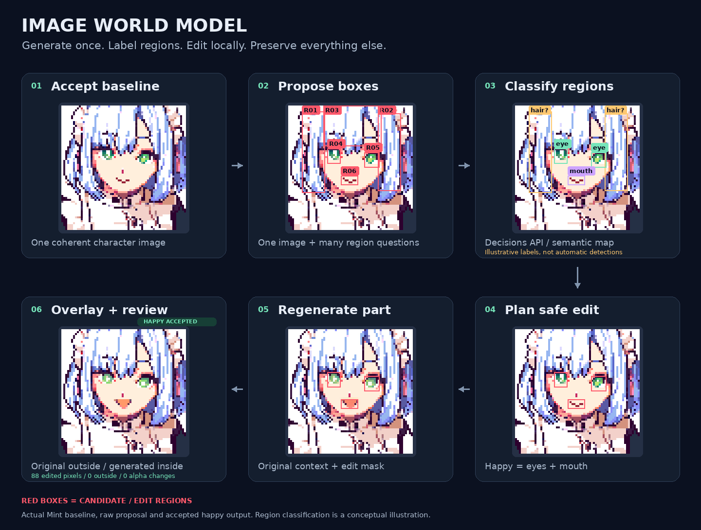
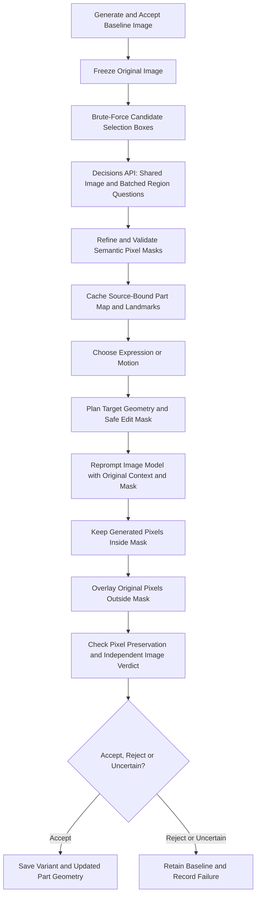

# Image World Model Approximation

[Open the illustrated HTML version](image-world-model.html)

## Flowchart

```mermaid
flowchart TD
    A[Generate and Accept Baseline Image] --> B[Freeze Original Image]
    B --> C[Brute-Force Candidate Selection Boxes]
    C --> D[Decisions API: Shared Image and Batched Region Questions]
    D --> E[Refine and Validate Semantic Pixel Masks]
    E --> F[Cache Source-Bound Part Map and Landmarks]
    F --> G[Choose Expression or Motion]
    G --> H[Plan Target Geometry and Safe Edit Mask]
    H --> I[Reprompt Image Model with Original Context and Mask]
    I --> J[Keep Generated Pixels Inside Mask]
    J --> K[Overlay Original Pixels Outside Mask]
    K --> L[Check Pixel Preservation and Independent Image Verdict]
    L --> M{Accept, Reject or Uncertain?}
    M -->|Accept| N[Save Variant and Updated Part Geometry]
    M -->|Reject or Uncertain| O[Retain Baseline and Record Failure]
```
